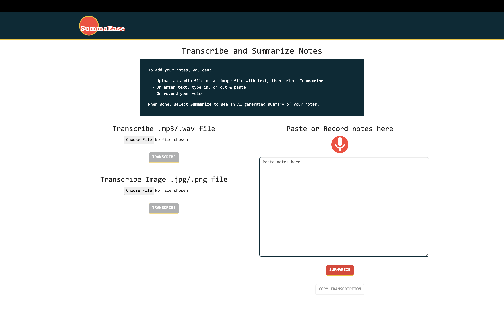

# summaEase
 Transcribe and Summarize Notes (AI generated summary)

This project leverages Flask, Bootstrap, and GeminiPro 1.0 to construct a comprehensive AI-driven note-taking application, building upon the foundational work of troplaflemme (https://github.com/KhanradCoder/troplaflemme) by **Adam Eubanks (https://github.com/KhanradCoder)**. I would like to acknowledge Mr. Eubanks's contributions and express my gratitude for providing the foundation for SummaEase.

**Key Enhancements**:

* **Aesthetic Refinements**: Implemented CSS modifications.
* **Copy-Paste Functionality**: Introduced buttons to enable users to easily copy and paste both the transcription and summarized text.
* **Image-to-Text Conversion**: Using PyTesseract and OpenCV, added the ability to convert images containing text into text format for processing.
	* (```app.py```, ```upload_image()``` function), hyperparameters 178, 255 in ```cv2.threshold(gray, 178, 255, cv2.THRESH_BINARY)[1]``` are set for a specific set of images, hence, they may not reproduce the same results with other images

This application is designed for local deployment and is optimized to function within Google Chrome. While it may be possible to access the application using other browsers or operating systems, certain features and functionalities may be limited or unavailable.

# Screenshot



## Usage 
* Locate the file named ```config.ini```
* Add your Gemini API token to ```config.ini```
* Run the app with ```flask run```
